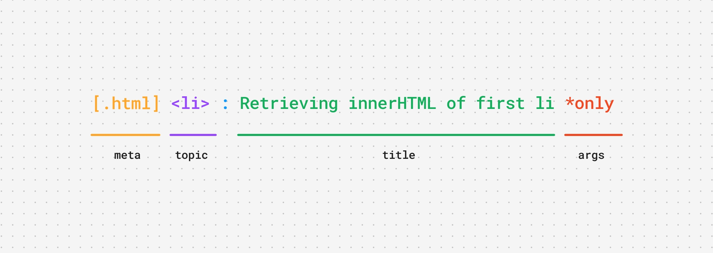

# Test Titles

It is a simple formatting-language based string generator to produce more vivid and practical test titles for you next project.

## Core Philosophy

| Symbol | Element | Color   | Purpose  |
| ------ | ------- | ------- | -------- |
| \.     | Meta    | Yellow  | Classify |
| \#     | Topic   | Magenta | Identify |
|        | Title   | White   | Text     |
| \*     | Args    | Red     | Modifier |

1. You can use more than one meta element; they function like classes assigned to an HTML element.
2. However, you can only add a single topic name to each title, which behaves like an ID assigned to an HTML element.
3. You can also add any number of arguments to the title, which are similar to the arguments passed to a function.
4. Every other word without any symbol prefixed to it will be regarded as text for the title.
